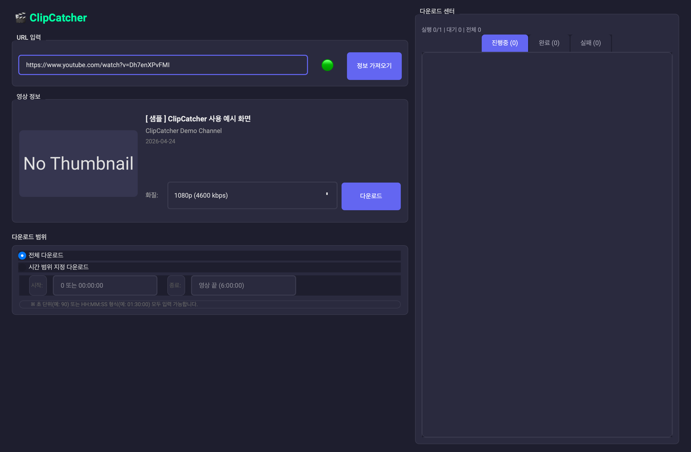
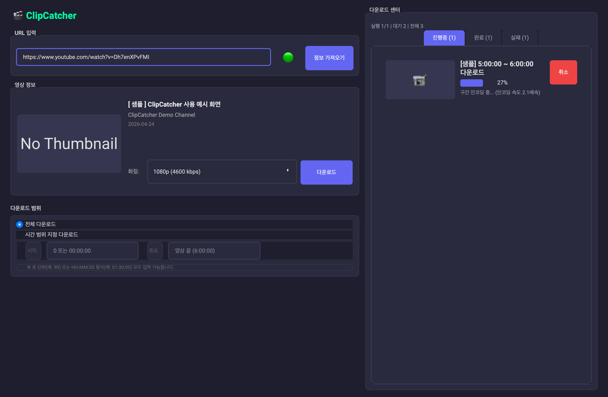
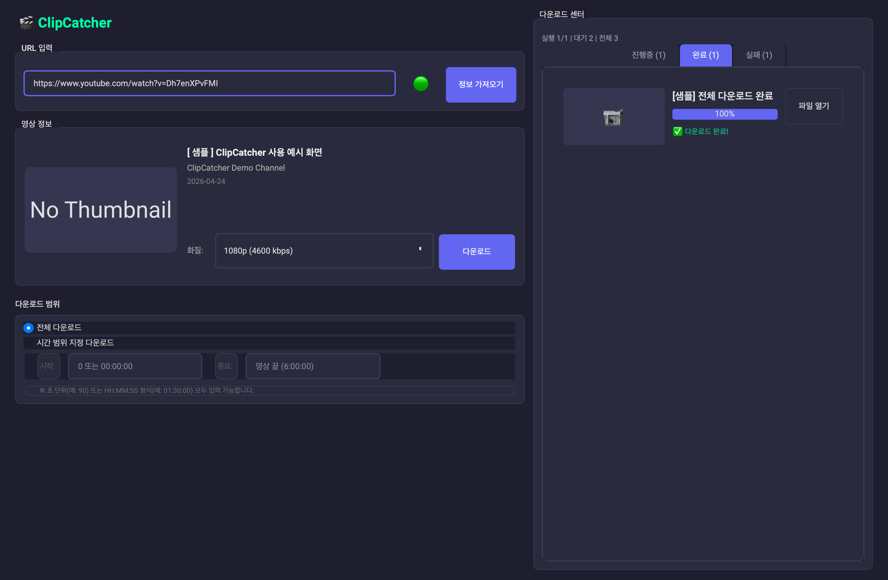
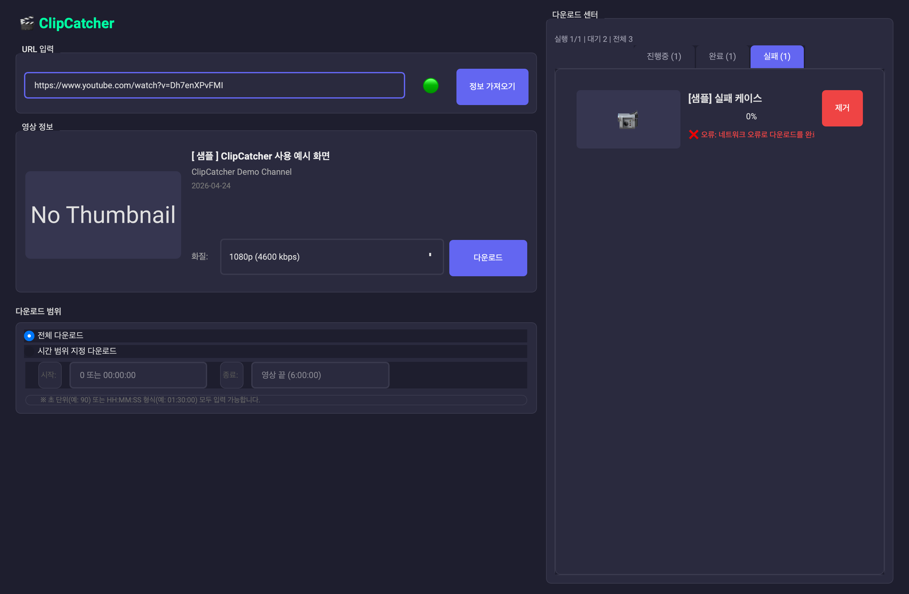
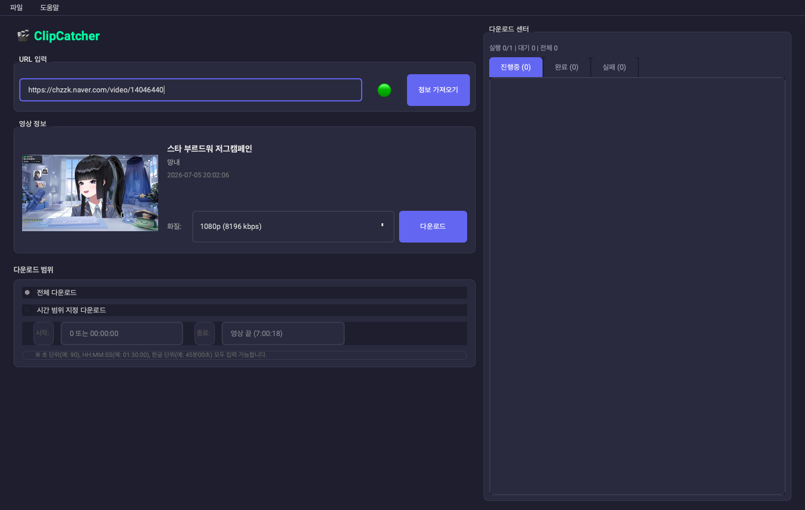
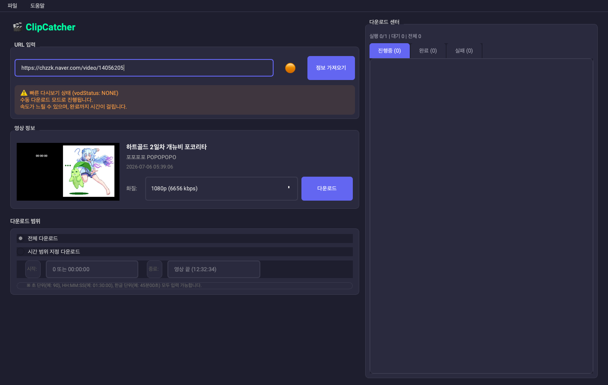

# ClipCatcher

치지직 VOD와 클립을 다운로드할 수 있는 데스크톱 애플리케이션입니다.

ClipCatcher는 기존 `chzzkdownloader`를 발전시킨 후속작으로, 더 나은 UI, 더 안정적인 다운로드 경험, 그리고 확장 가능한 구조를 목표로 만들었습니다.
이 계정에서는 ClipCatcher를 대표 프로젝트로 운영합니다.

## Why ClipCatcher

- 치지직 VOD와 클립을 더 편하게 다운로드
- GUI 기반으로 누구나 쉽게 사용 가능
- Windows / macOS에서 바로 실행 가능한 배포본 제공
- 이후 채팅/분석 도구와 연결 가능한 메인 앱

## Main Features

- 치지직 VOD 다운로드
- 치지직 클립 다운로드
- 해상도 선택 및 다운로드 품질 제어
- 직관적인 GUI 제공
- 크로스 플랫폼 배포 지원

## Screenshots



| 진행중 | 완료 |
| --- | --- |
|  |  |

| 실패 |
| --- |
|  |

### 실제 링크 정보 조회 예시

아래 화면은 예시 치지직 VOD 링크를 앱에 입력한 뒤 `정보 가져오기`로 영상 정보와 화질 목록을 불러온 상태입니다.

| https://chzzk.naver.com/video/14046440 | https://chzzk.naver.com/video/14056205 |
| --- | --- |
|  |  |

## Project Position

ClipCatcher는 이 계정의 대표 프로젝트입니다.

관련 보조 도구:
- [chzzk-chat-exporter](https://github.com/ThankyouJerry/chzzk-chat-exporter): 치지직 채팅을 CSV로 내보내는 크롬 확장 프로그램
- [streamstamp](https://github.com/ThankyouJerry/streamstamp): 유튜브 타임스탬프 관리 도구

## Download

최신 실행 파일은 [Releases](https://github.com/ThankyouJerry/ClipCatcher/releases) 페이지에서 받을 수 있습니다.

- Windows: `ClipCatcher-Windows.zip`
- macOS: `ClipCatcher-macOS.zip`

## Website

ClipCatcher 소개, 사용사례, 사용법은 GitHub Pages에서 볼 수 있습니다.

- [ClipCatcher Website](https://thankyoujerry.github.io/ClipCatcher/)

## Runtime Dependency

실행/병합 과정에서 아래 도구가 필요합니다.

- `ffmpeg`
- `ffprobe`
- `yt-dlp` (소스 실행 기준)

## Run From Source

```bash
git clone https://github.com/ThankyouJerry/ClipCatcher.git
cd ClipCatcher
pip install -r requirements.txt
python src/main.py
```

## Recommended For

- 치지직 다시보기를 자주 저장하는 사용자
- 클립과 VOD를 한 앱에서 관리하고 싶은 사용자
- GUI 기반 다운로드 도구를 선호하는 사용자

## Copyright Notice

ClipCatcher는 사용자가 접근 가능한 영상의 저장을 돕는 도구입니다.
프로그램 사용과 다운로드는 자유롭게 할 수 있지만, 영상과 음성 등 콘텐츠의 저작권은 원 저작권자에게 있습니다.
개인 보관 범위를 넘어 재업로드, 공유, 편집물 공개, 상업적 이용을 할 때는 각 플랫폼의 이용약관과 원 저작권자의 허락 범위를 반드시 확인해주세요.

## Roadmap

- 다운로드 안정성 개선
- UI/UX 개선
- 채팅/분석 도구와의 워크플로우 연결 강화

## License

MIT License
