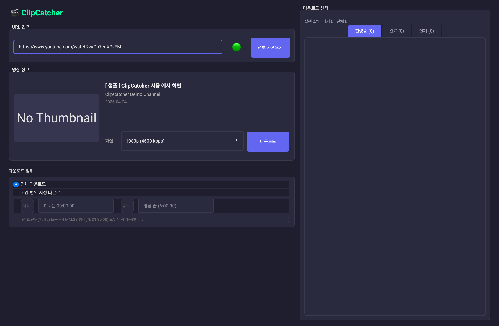
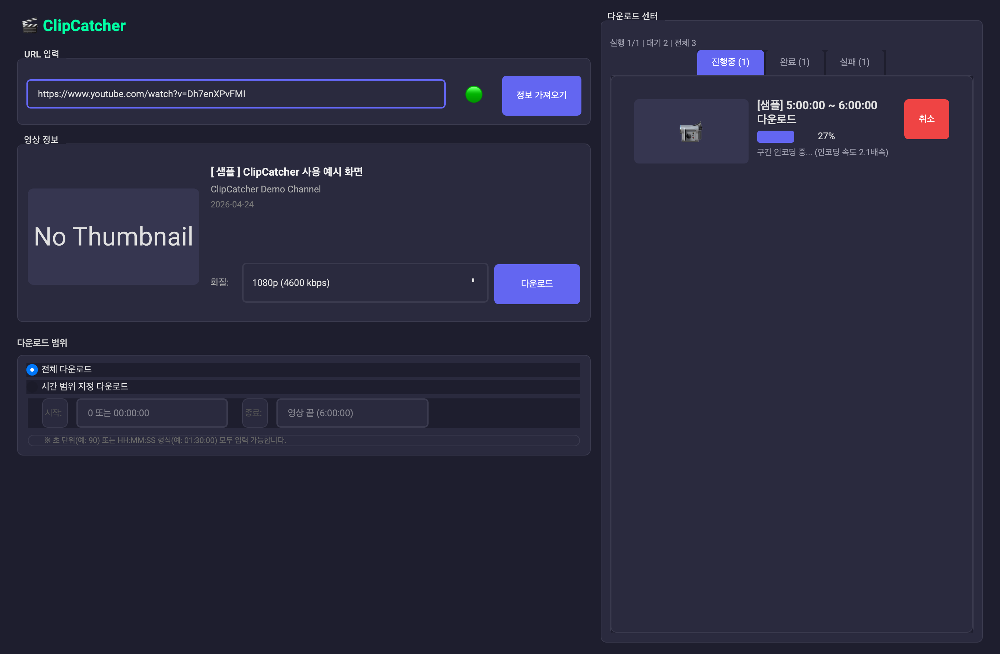
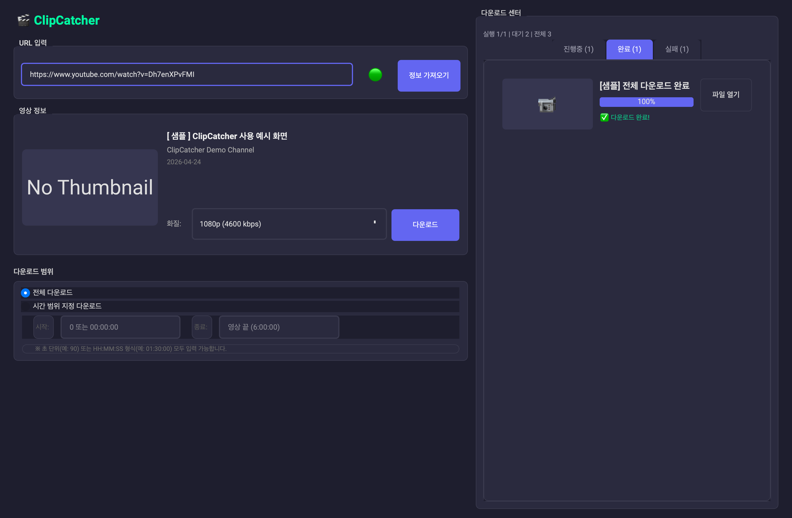
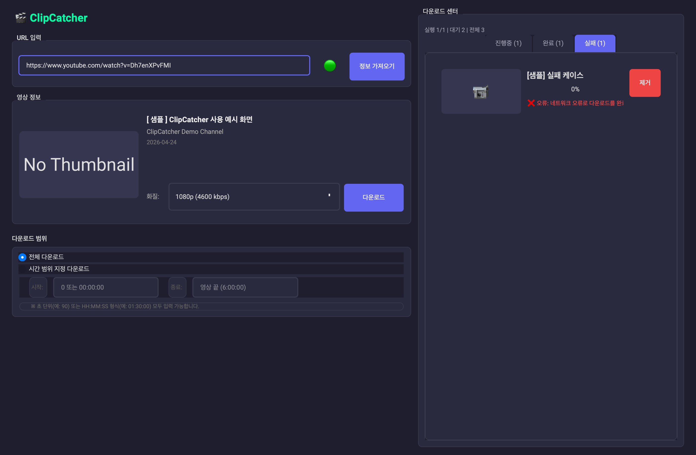
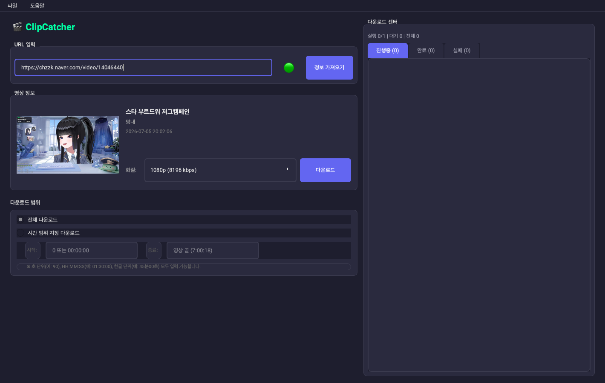
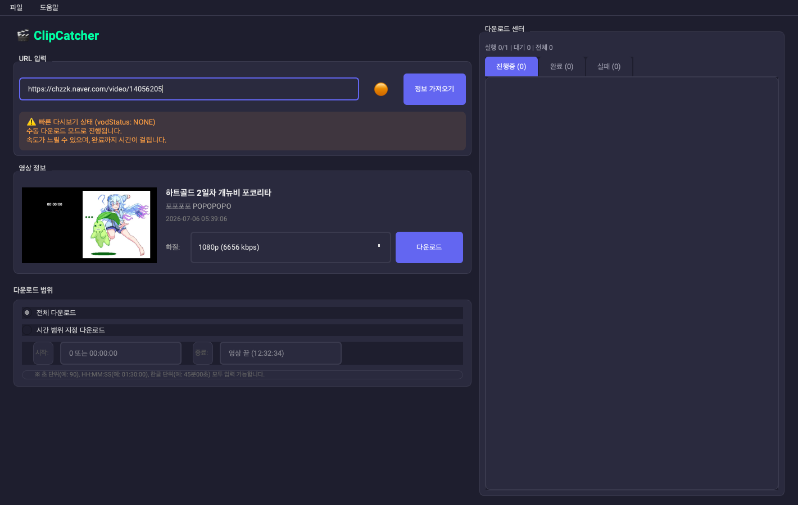

# ClipCatcher

치지직 VOD와 클립을 다운로드할 수 있는 데스크톱 애플리케이션입니다.

ClipCatcher는 기존 `chzzkdownloader`를 발전시킨 후속작으로, 더 나은 UI, 더 안정적인 다운로드 경험, 그리고 확장 가능한 구조를 목표로 만들었습니다.
이 계정에서는 ClipCatcher를 대표 프로젝트로 운영합니다.

## Why ClipCatcher

- 치지직 VOD와 클립을 더 편하게 다운로드
- GUI 기반으로 누구나 쉽게 사용 가능
- Windows / macOS에서 바로 실행 가능한 배포본 제공
- 이후 채팅/분석 도구와 연결 가능한 메인 앱

## Main Features

- 치지직 VOD 다운로드
- 치지직 클립 다운로드
- 해상도 선택 및 다운로드 품질 제어
- 여러 영상 링크를 한 줄씩 붙여넣어 기본 순차 대기열에 추가
- 순차 다운로드 큐와 진행중/완료/실패 상태 관리
- 완료 파일 및 다운로드 저장 폴더 바로 열기
- YouTube 다운로드의 Final Cut Pro 호환 코덱 우선 선택
- 치지직 빠른 다시보기의 실제 HLS 길이 기반 시간 범위 검증
- 직관적인 GUI 제공
- 크로스 플랫폼 배포 지원

## Latest Update

개발 브랜치에는 `도움말 → yt-dlp 상태 확인` 메뉴를 추가했습니다. 현재 사용 가능한 yt-dlp의 버전과 경로를 확인하고 재검사할 수 있습니다. 설치나 업데이트를 자동으로 수행하지 않습니다. 이 기능은 아래 `v2.0.11` 배포본에는 아직 포함되지 않았으며, 최신 Windows 빌드는 [GitHub Actions](https://github.com/ThankyouJerry/ClipCatcher/actions/workflows/build.yml)의 성공한 실행에서 `ClipCatcher-Windows` 아티팩트로 받을 수 있습니다(GitHub 로그인 필요).

`v2.0.11`에서는 `단일 파일`·`여러 파일` 입력 모드, 이미 사용 가능한 `yt-dlp`의 재설치 안내 생략, 다운로드 작업 스레드 수명 관리, 비표준 해상도 표시와 저장 파일명 충돌 방지를 반영했습니다. 업데이트하려면 [최신 배포본](https://github.com/ThankyouJerry/ClipCatcher/releases/latest)을 받아 기존 앱을 교체해주세요. 기존 설정과 다운로드한 영상은 유지됩니다.

`v2.0.10`에서는 변경된 치지직 클립 API에 맞춰 클립 정보·화질 조회와 다운로드를 복구했습니다. 다운로드 시작 직전에 NAVER 재생 API에서 만료되지 않은 클립 주소를 다시 받아 대기열에서도 안정적으로 처리합니다. 치지직 VOD/클립과 YouTube 링크를 실제 호스트 기준으로 검증하고, 메타데이터 요청에 시간 제한·재시도·응답 크기 제한을 적용했습니다. 앱에서 설치하는 `yt-dlp`는 공식 SHA-256 체크섬과 실행 가능 여부를 확인한 뒤에만 기존 파일을 교체합니다.

다운로드 안정성도 함께 강화했습니다. YouTube 재생목록 링크는 선택한 영상 한 개만 처리하며, 취소할 때 `yt-dlp`와 수동 HLS 병합에 사용되는 FFmpeg 프로세스까지 함께 종료합니다. 빠른 다시보기용 HLS 쿠키는 NAVER 도메인에만 전송하고, 재생목록/세그먼트 다운로드에는 제한 시간·재시도·크기 제한을 적용합니다. 앱 전용 `yt-dlp` 설치·업데이트는 백그라운드에서 진행되어 설치 중에도 화면이 멈추지 않습니다.

버전별 변경 내용은 [CHANGELOG.md](CHANGELOG.md)에서 확인할 수 있습니다.

## 사용 방식

- 개발 버전: 상단 메뉴바의 `도움말 → yt-dlp 상태 확인`에서 사용 가능 여부·버전·경로를 확인하고 `다시 확인`으로 재검사할 수 있습니다. 설치 파일을 변경하지 않으며, 최신 버전 조회는 아닙니다. 업데이트는 별도의 `yt-dlp 설치/업데이트` 메뉴를 사용합니다.

- `단일 파일`: 링크 하나의 정보를 가져온 뒤 화질과 시작·종료 시간을 선택해 다운로드합니다.
- `여러 파일`: 링크를 한 줄에 하나씩 입력하고 `대기열에 추가`를 누릅니다. 각 영상은 전체 길이와 확인 가능한 최고 화질로 추가되며, 기본 설정에서는 한 개씩 순서대로 다운로드합니다. 추가 중에는 버튼을 다시 눌러 남은 링크 조회를 중단할 수 있습니다.

## Screenshots



| 진행중 | 완료 |
| --- | --- |
|  |  |

| 실패 |
| --- |
|  |

### 실제 링크 정보 조회 예시

아래 화면은 예시 치지직 VOD 링크를 앱에 입력한 뒤 `정보 가져오기`로 영상 정보와 화질 목록을 불러온 상태입니다.

| https://chzzk.naver.com/video/14046440 | https://chzzk.naver.com/video/14056205 |
| --- | --- |
|  |  |

## Project Position

ClipCatcher는 이 계정의 대표 프로젝트입니다.

관련 보조 도구:
- [chzzk-chat-exporter](https://github.com/ThankyouJerry/chzzk-chat-exporter): 치지직 채팅을 CSV로 내보내는 크롬 확장 프로그램
- [streamstamp](https://github.com/ThankyouJerry/streamstamp): 유튜브 타임스탬프 관리 도구

## Download

최신 실행 파일은 [Releases](https://github.com/ThankyouJerry/ClipCatcher/releases) 페이지에서 받을 수 있습니다.

- Windows: `ClipCatcher-Windows.zip`
- macOS: `ClipCatcher-macOS.zip`

## Website

ClipCatcher 소개, 사용사례, 사용법은 GitHub Pages에서 볼 수 있습니다.

- [ClipCatcher Website](https://thankyoujerry.github.io/ClipCatcher/)

## Runtime Dependency

실행/병합 과정에서 아래 도구가 필요합니다.

- `ffmpeg`
- `ffprobe`
- `yt-dlp` (소스 실행 기준)

이미 실행 가능한 `yt-dlp`가 앱 전용 폴더, 시스템 경로 또는 Python 패키지에 있다면 다시 설치하지 않아도 됩니다. 비트레이트 정보가 없으면 `kbps` 수치만 생략합니다. `자동 선택 (다운로드 시 화질 결정)`은 해상도 목록을 확보하지 못해 다운로드 시 사용 가능한 포맷을 고른다는 뜻입니다. YouTube는 Final Cut 호환 H.264 화질을 표시하며, 2:1·세로 영상 등은 `960p (1920×960)`처럼 실제 크기를 표시합니다.

## Run From Source

```bash
git clone https://github.com/ThankyouJerry/ClipCatcher.git
cd ClipCatcher
pip install -r requirements.txt
python src/main.py
```

## Recommended For

- 치지직 다시보기를 자주 저장하는 사용자
- 클립과 VOD를 한 앱에서 관리하고 싶은 사용자
- GUI 기반 다운로드 도구를 선호하는 사용자

## Copyright Notice

ClipCatcher는 사용자가 접근 가능한 영상의 저장을 돕는 도구입니다.
프로그램 사용과 다운로드는 자유롭게 할 수 있지만, 영상과 음성 등 콘텐츠의 저작권은 원 저작권자에게 있습니다.
개인 보관 범위를 넘어 재업로드, 공유, 편집물 공개, 상업적 이용을 할 때는 각 플랫폼의 이용약관과 원 저작권자의 허락 범위를 반드시 확인해주세요.

## Roadmap

- 다운로드 안정성 개선
- UI/UX 개선
- 채팅/분석 도구와의 워크플로우 연결 강화

## License

MIT License
